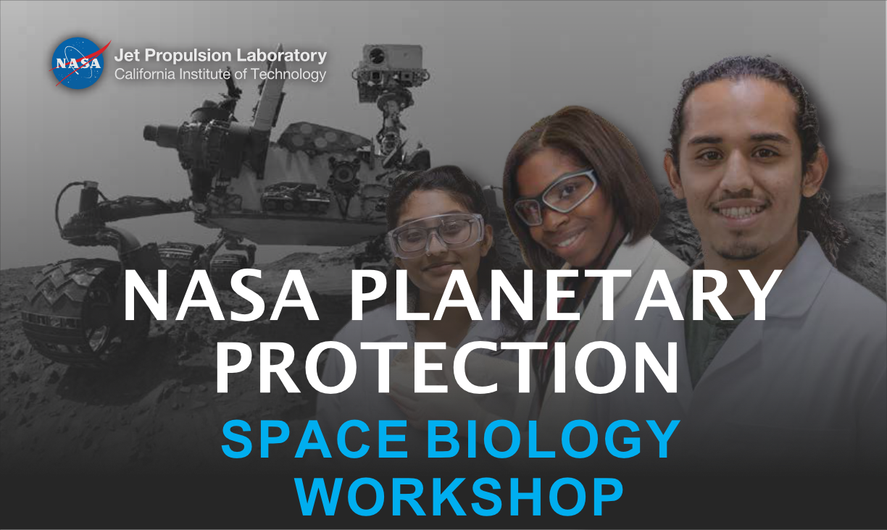

# JPL-2023-PRISM
The 2023 JPL Preparing for Research in Space Microbiology (PRISM) program takes place over roughly March through May.

**Please see the wiki [here](https://github.com/AstrobioMike/JPL-2023-PRISM/wiki).**

